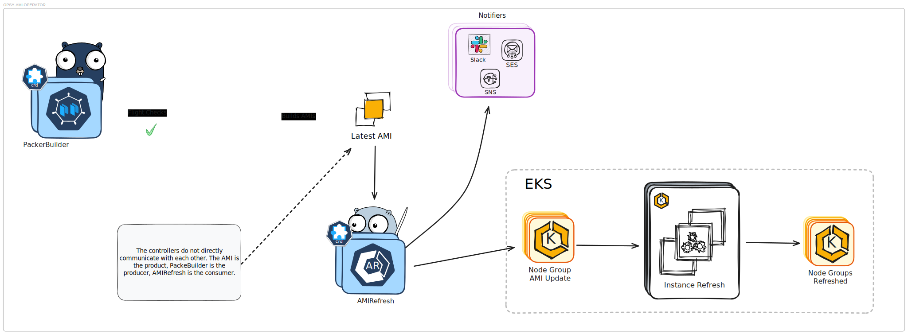

# Opsy AMI Operator

 Reconciliation based on Filtered Base AMI


- [Opsy AMI Operator](#opsy-ami-operator)
  - [Introduction](#introduction)
  - [Features](#features)
  - [Overview](#overview)
  - [AMI Building Using Packer](#ami-building-using-packer)
    - [Status](#status)
    - [Command](#command)
    - [Notifications](#notifications)
  - [Node Group AMI Instance Refreshing](#node-group-ami-instance-refreshing)
  - [Prerequisites](#prerequisites)
  - [Installation](#installation)

## Introduction

The Opsy AMI Operator is designed to automate the process of building AMIs using Packer and refreshing AMIs for EKS node groups. Since each controller has it own CRD you do not have to run both. You could strictly use the packer-builder-controller for AMI creation or the ami-refresh-controller for node group refresh management.

## Features

- Automatically checks for the latest AMI of your base AMI using provided filters.
- Creates and monitors Kubernetes jobs for AMI building, if necessary, using Packer.
- Ensures node groups always use the `status:active` AMI when under management.
- Performs node group instance refreshing with an option to exclude specific node groups.


## Overview
The operator is responsible for two primary actions


## AMI Building Using Packer

`PackerBuilder`

```yaml
apiVersion: ami.refresh.ops/v1alpha1
kind: PackerBuilder
metadata:
  labels:
  name: packer-builder-local
spec:
  amiFilters:
    - name: "name"
      values: ["amazon-eks-node-al2023-x86_64-standard-1.30*"]
    - name: "owner-id"
      values: ["602401143452"]
  clusterName: "opsy-gitops"
  timeOuts:
    expiresIn: "48h"
    controllerTimer: "5m"
  notifier:
    slack:
      channelIDs: ["SLACK_CHANNEL_IDS"]
      secret: "slack-token"
  gitSync:
    image: "registry.k8s.io/git-sync/git-sync:v4.2.3"
    name: "git-sync"
    secret: "git-sync"
  region: "us-west-2"
  builder:
    repoURL: "https://github.com/ibeify/eks-node-group-ami-refresh"
    branch: "main"
    image: "hashicorp/packer:latest"
    dir: "packer/generic-fips"
    secret: "aws-creds"
    commands:
      - subCommand: "build"
        args:
          - "-force"
        color: false
        debug: true
        onError: "cleanup"
```

Primarily, the packer-build-controller runs packer builds as Jobs in Kubernetes.It only attempts to execute the build when it discovers an AMI does not exist with the appropriate tags.

  In general these tags are

  - A valid Creation Time Stamp tag.However the creation time stamp can also be taken directly from AWS
  - A status tag set to `active`
  - A Build ID identifying the instance of the PackerBuilder that owns this AMI. IF the PackBuilder Instance is removed the relationship is severed
  - Default tags ensuring its identity as managed by the operator. Repo name, branch, etc.

  Tags ensure we do not attempt to prematurely recreate a managed AMI. With regards to AMI sourcing, a Base AMI can be discovered via provided filters. You don't not have to use the filter mechanism to source a Base AMI, you can run packer builds as self contained projects. The packer build itself is user provided and can be sourced from either a publicly or privately accessible repository. [Git-sync](https://github.com/kubernetes/git-sync) is used for pulling the packer repos from source. Example packer projects can be found [packer](/packer/). This process is mostly idempotent, with a window between the discovery of the created AMI and the job completely terminating ( default, `hardcoded`, is 15min after completion/failure of a job). Most testing has proven this to be a non-factor as an interruption in the controller should be short lived. Anyways, worth noting. You can control the reconciliation schedule of the controller and when an AMI should expire.

  ### Status
  The PackerBuilder Instance holds all relevant information regarding the status of the current or most recent build in its `Status` object.

  Things you can discover from the `status` of PackerBuilder

  - The build ID associated with the Instance
  - The command used for running the packer Job
  - The number of Previously Failed Jobs ( default allowed at any time is `3`)
  - The job ID associated with the most recent Job, this used in part to name the job
  - The status of the Last run Job
  - The execution timestamp of the last run job
  - The base AMI ID used for the last run job
  - The built AMI ID used for the last run job

    ```yaml
    status:
      buildID: 728d7a64-ca85-42c9-9acd-60c681d4efe3
      command: packer init -upgrade . && packer validate . && packer build -var 'eks_version=1.30'
        -var 'region=us-west-2' -var-file=al2_amd64.pkrvars.hcl -color=false .
      conditions:
      - lastTransitionTime: "2024-09-01T18:05:40Z"
        message: Latest Created AMI ami-0d2587d8e405f376c has not expired and is active
        reason: FlightCheckFailed
        status: "True"
        type: FlightCheckFailed
      failedJobCount: 0
      jobID: 3cb1b
      jobName: packer-builder-remote-3cb1b
      jobStatus: completed
      lastRun: "2024-09-01T18:30:48Z"
      lastRunBaseImageID: ami-05da30e98c637628c
      lastRunBuiltImageID: ami-0d2587d8e405f376c
      lastRunMessage: Reconciliation in progress
      lastRunStatus: running
    ```
  ### Command

  By default if no commands are provided the controller will attempt the below command,
  ```bash
  > packer init . && packer validate . && packer build -color=false .
  ```
The order of operation will always be `init`, `validate`, `build`. If only a build command is provided the controller will add init and validate using the working directory provided by the build. There are a few working ( As of writing this in 2024 ) [samples](config/samples)

  ### Notifications

  Currently you can send messages regarding state transitions (JobRunning -> JobCompleted for example). We support

  - `Slack`: Requires slack bot token and list of channels.
  - `SNS` (TBD)
  - `SES` (TBD)
  - `Discord` (TBD)

  

    ### Image Adoption
    The controller is capable of finding previously created AMIs and adopting management of the AMI.This comes in handy if you completely remove the associated packerBuilder from the cluster. Since there can only be one, it looks for that Special AMI... This is enabled by default.

    - The AMI will need to have an `active` status tag
    - The AMI should not be expired.
    - In addition to above the AMI should have the following tags
      ```bash
        "brought-to-you-by":  "opsy-the-ami-operator",
        "cluster-name":       "opsy-eks",
        "created-by":         "name-of-your-crd-instance",
        "packer-repo":        "repo-where-packer-code-was-sourced",
        "packer-repo-branch": "branchable-branch",
      ```
      These tags have worked well thus far. If you find additional scrutiny is needed feel free to open a PR.


## Node Group AMI Instance Refreshing

`AMIRefresher`

```yaml
apiVersion: ami.refresh.ops/v1alpha1
kind: AMIRefresher
metadata:
  labels:
    app.kubernetes.io/name: amirefresher
    app.kubernetes.io/instance: amirefresher-sample
    app.kubernetes.io/part-of: opsy-ami-operator
    app.kubernetes.io/managed-by: kustomize
    app.kubernetes.io/created-by: opsy-ami-operator
  name: node-group-ami-refresh
spec:
  region: "us-west-2"
  # ami: "ami-0e41642144107e7b3"
  amiFilters:
    - name: "name"
      values: ["amazon-eks-node-al2023-x86_64-standard-1.30*"]
    - name: "owner-id"
      values: ["602401143452"]
  clusterName: "ibeify-gitops"
  expiresIn: "5m" # 1h, 1d, 1w, 1m, 3m, 6m, 1y
  exclude:
    - "ingress-dev"
```

The controller looks for an AMI either provided as an ID or using filters to a source AMI's Base AMI. All managed AMI by the operator are tagged with specific fields like creation timestamp and Base AMI. These tags are used to identify valid AMI for deployment to the cluster. In general `only` AMIs that have not expired and are active are eligible for deployment to the cluster. There is usually never more than one AMI per AMIRefresh instance.The sourced AMI is used to update the launch template of node groups in the cluster ( we can exclude node groups ).The operator initiates an instance refresh on behave of the node group. The ami must have tag, `status: active` and not be expired in order to be considered by the operator


## Prerequisites

- A cluster to run jobs from
- An IRSA Role for the packer job.[See IAM Policy details ](https://developer.hashicorp.com/packer/integrations/hashicorp/amazon#iam-task-or-instance-role)
  ```yaml
    apiVersion: v1
    kind: ServiceAccount
    metadata:
    name: eks-ami-builder
    namespace: default
    annotations:
        eks.amazonaws.com/role-arn: arn:aws:iam::012345678910:role/eks-packer-builder
  ```
- If a serviceaccount is not provided via `PackerBuilder.Spec.Builder.JobServiceAccountName` a secret name will be required `PackerBuilder.Spec.Builder.Secrets`.
- This project uses [git-sync](https://github.com/kubernetes/git-sync) to pull repos for the packer job. You'll need to provide credentials to access your private repos.Below is a simple example for github tokens. More on this can be found in the [manual](https://github.com/kubernetes/git-sync)
  ```yaml
  apiVersion: v1
  kind: Secret
  metadata:
    name: git-credentials
    namespace: default  # Change this if you're using a different namespace
  type: Opaque
  data:
    username: c2VjcmLTQ1Nzg5=
    token: Y2hwZ0kxRDU5Q0VrVUtPZ0hzTEdjemFqeTM1UEJhYg==
  ```

- At a minimum your packer project will need to accept an ami and a region as variables from the controller if it intends to use the filters to find the Base AMI. Please define ami as `ami_id` and region as `region`. Below is an example using hcl2

  ```c
  variable "ami_id" {
  type    = string
  default = "ami-0c2b8ca1dad447f8a"
  }

  variable "region" {
  type    = string
  default = "us-east-1"
  }
  ```


## Installation

**Build and push your image to the location specified by `IMG`:**

```sh
make docker-build docker-push IMG=<some-registry>/opsy-ami-operator:tag
```
**NOTE:** This image ought to be published in the personal registry you specified.
And it is required to have access to pull the image from the working environment.
Make sure you have the proper permission to the registry if the above commands don’t work.

**Install the CRDs into the cluster:**

```sh
make install
```

**HELM**
```bash
❯ helm repo add opsy-ami-operator https://ibeify.github.io/opsy-ami-operator
❯ helm repo update
❯ helm upgrade --install opsy-ami opsy-ami-operator/opsy-ami-operator --version 1.7.0 \
  --namespace opsy --create-namespace \
  --set controllerManager.manager.image.repository=<repository> \
  --set controllerManager.manager.image.tag=<version> \
  --set-json 'controllerManager.serviceAccount.annotations={"eks.amazonaws.com/role-arn": "arn:aws:iam::012345678910:role/eks-packer-builder"}'

```

