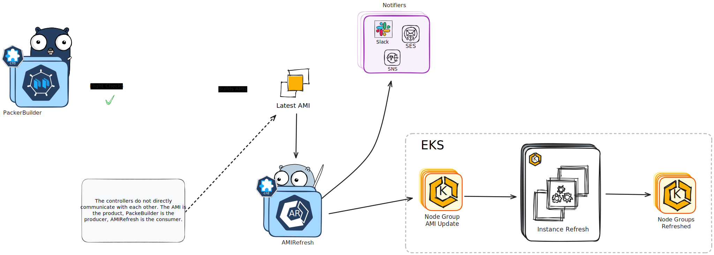

## Design

*Reconciliation based on Filtered Base AMI*

The Opsy AMI Operator automates the process of building and refreshing Amazon Machine Images (AMIs) for Amazon EKS node groups. It consists of two primary components:

1. AMI Building Using Packer
2. Node Group AMI Instance Refreshing

### **AMI Building Using Packer**

This component is managed by the `PackerBuilder` Custom Resource Definition (CRD).

**Key features:**

- Automatically checks for the latest AMI using provided filters
- Creates and monitors Kubernetes jobs for AMI building using Packer
- Ensures node groups use the `status:active` AMI when under management
- Uses Git-sync to pull Packer configurations from a repository
- Supports notifications (currently Slack, with plans for SNS, SES, and Discord)
- Can adopt previously created AMIs that meet specific criteria

**Process:**

- Checks if an AMI with appropriate tags exists and is **NOT** expired.
- If not, initiates a Packer build job in Kubernetes
- Monitors the build process and updates the `PackerBuilder` status
- Tags the resulting AMI with metadata (creation time, status, build ID, etc.)
- Attempts to clean up any lingering artifacts such as security groups and keypairs 

- Supports custom Packer commands and working directories

### **Node Group AMI Instance Refreshing**

This component is managed by the `AMIRefresher` CRD.

**Key features:**

- Looks for an AMI either by ID or using filters
- Updates the launch template of node groups in the cluster
- Initiates instance refresh for node groups
- Allows exclusion of specific node groups
- Ensures only non-expired, active AMIs are used

**Process:**

1. Identifies a suitable AMI (either specified directly or via filters)
2. Verifies the AMI is tagged as active and not expired
3. Updates the launch template for eligible node groups
4. Initiates an instance refresh for updated node groups

## **General Functionality**

- Both components can work independently or together, one hand washes the other both wash the face.
- Uses custom resource definitions (CRDs) for configuration. Events, Conditions, Statuses using `kubectl`, slack notifications. You're going to know if you broke something immediately
- Supports various timeouts and expiration settings
- Provides detailed status information in the CRD objects
- Requires specific IAM roles and permissions to function properly